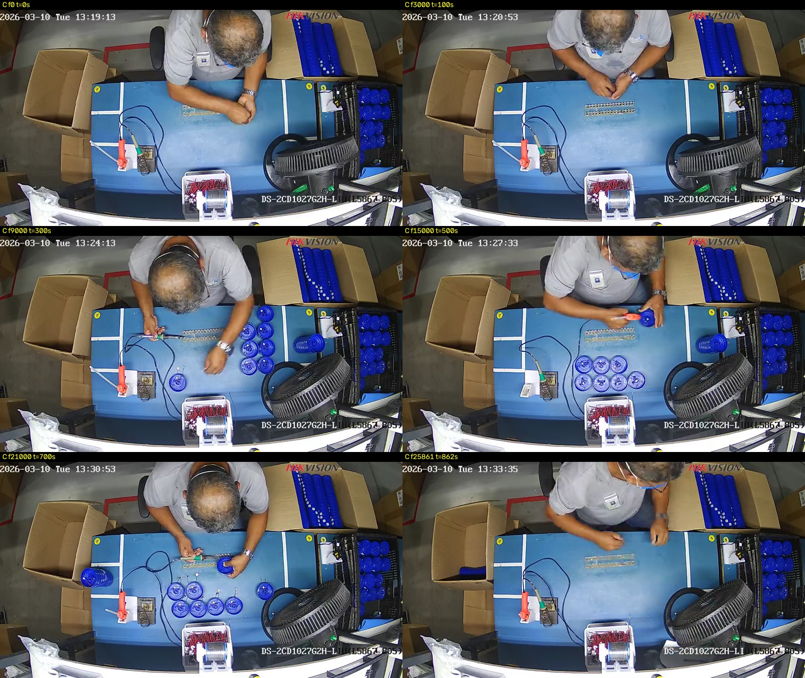
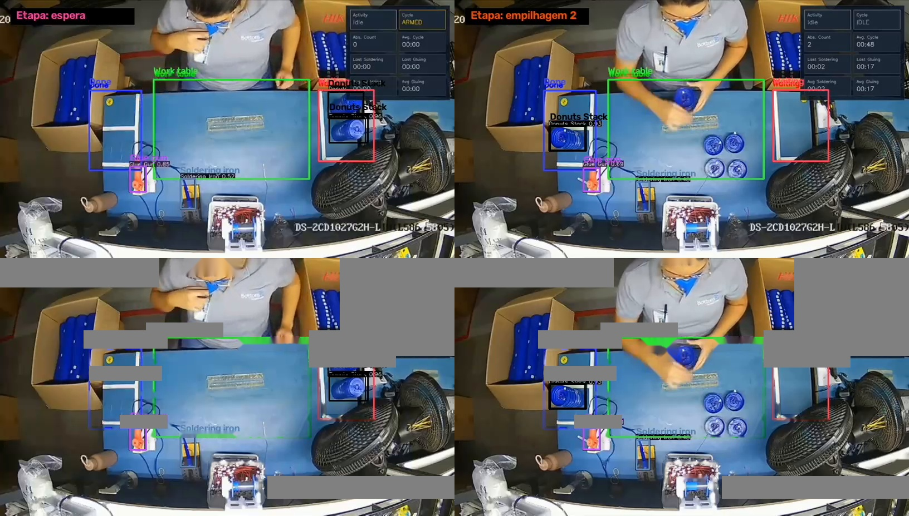
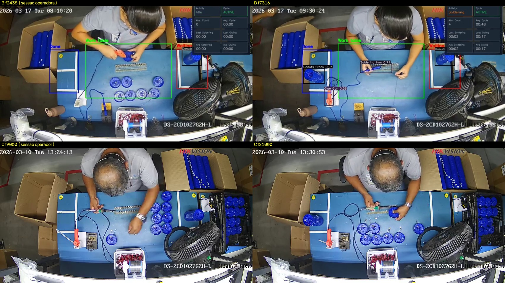
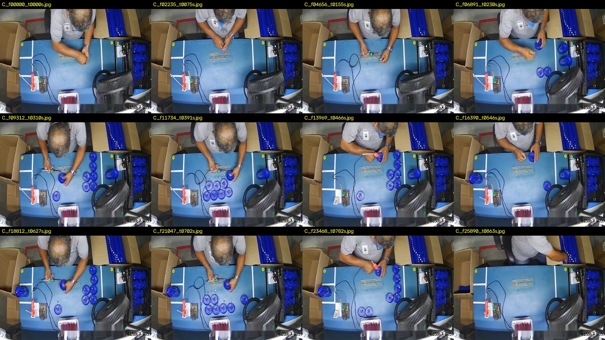
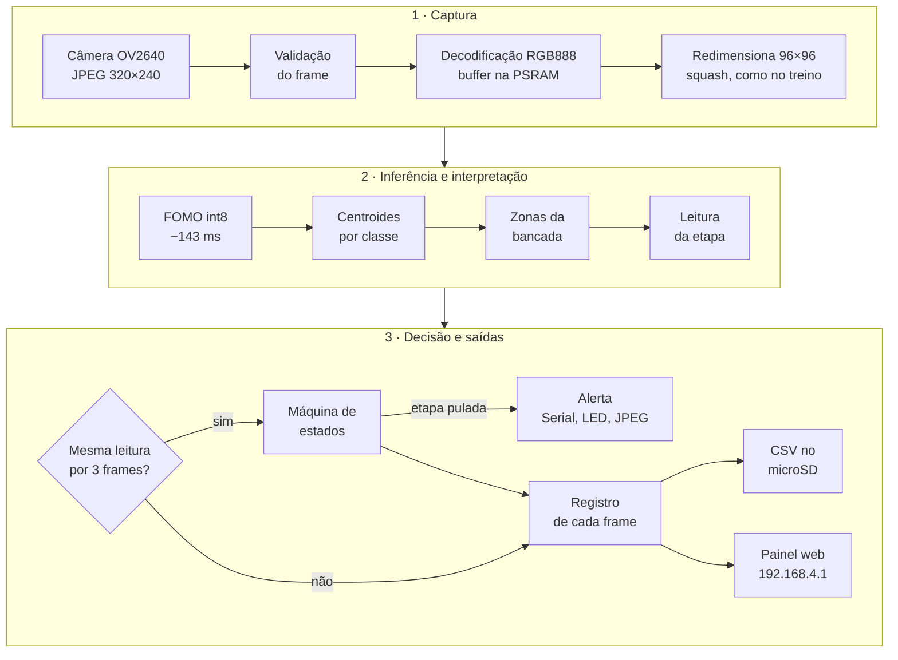
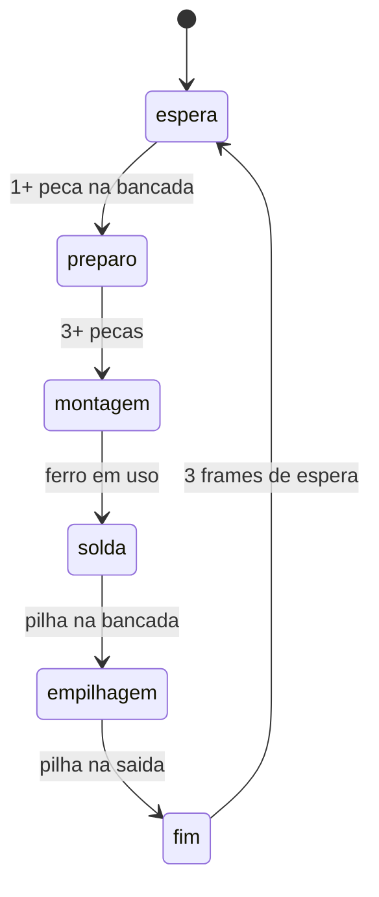
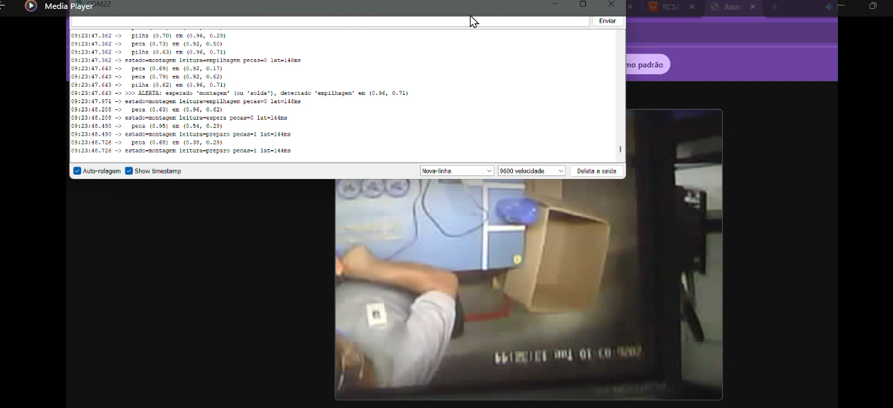
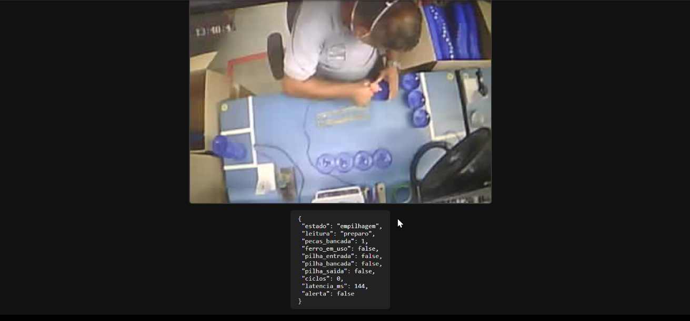

# AssemblyGuard — Relatório Técnico do Projeto

**Detecção de Etapas de Montagem e Falhas via TinyML aplicado ao Bloq Volt**

| Item | Informação |
|---|---|
| **Curso** | IESTI01 — TinyML (turma CR018-2026_2026_S2_T01) |
| **Mentor** | Prof. Marcelo Rovai |
| **Instituição** | BottomUP Technology |
| **Grupo** | Carlos Santana · Felipe Patrício · Julio Silva · Ewerton Victor · Marco Antônio (papéis na seção 1.5) |
| **Plataforma** | Seeed Studio XIAO ESP32S3 Sense (câmera OV2640) |
| **Repositório** | [github.com/karlsantana/IA_ASSEMBLE_PROJECT](https://github.com/karlsantana/IA_ASSEMBLE_PROJECT) |
| **Data** | Setembro de 2026 (proposta de projeto: julho de 2026) |

---

## Resumo

O AssemblyGuard é um sistema de visão computacional embarcado que acompanha a
montagem do Bloq Volt em uma bancada e verifica, em tempo real, se as etapas
seguem a sequência prevista. Um **Seeed Studio XIAO ESP32S3 Sense** executa
localmente um modelo de detecção de objetos **FOMO** (MobileNetV2 α = 0,35,
entrada 96×96 em tons de cinza, quantizado em int8) treinado no Edge Impulse.
O firmware converte as detecções — peças, pilhas de peças, ferro de solda e
aplicador de cola — em centroides, cruza os de peças, pilhas e ferro com
quatro zonas da bancada e deduz a etapa corrente, alimentando uma máquina de
estados com confirmação temporal de três frames. Desvios de sequência geram
alerta (com a posição da pilha ou do ferro que motivou a leitura), o frame é salvo e cada inferência é
registrada em CSV no microSD; um painel web servido pela própria placa
mostra vídeo, zonas, detecções e estado.

O projeto evoluiu de um classificador de cena (V1) para detecção de objetos
(V2) após o feedback do mentor, com o dataset separado **por sessão e por
operador** (140 frames de treino, 60 de teste). No hardware, a inferência
leva **~143 ms** (meta ≤ 200 ms) e o laço completo processa de 3,5 a 4,2
quadros por segundo. O modelo de base (v1, anotação automática) obteve F1
0,54 na validação e **0,23 no teste entre sessões**; o diagnóstico — objetos
visíveis sem caixa ensinando o modelo a ignorá-los — motivou a revisão
humana das anotações e o modelo v2, com quatro classes, que é o que roda
hoje na placa. A validação de campo (≥ 10 ciclos e 10 desvios induzidos) é a
etapa seguinte.

---

## 1. Introdução

### 1.1 Contexto

O Bloq Volt é montado manualmente em uma bancada: peças plásticas circulares
azuis (chamadas de *donuts* no projeto) recebem componentes eletrônicos,
solda e cola, e são empilhadas. Uma câmera IP Hikvision filma a bancada de
cima. O fluxo físico é sempre o mesmo: o material entra pela **caixa de
estoque à direita**, é trabalhado na **área central** e a **pilha pronta sai
pela esquerda**.



*Figura 1 — Seis momentos da sessão C (câmera Hikvision). Estoque à direita,
ferro de solda e pistola de cola à esquerda da bancada, pilha pronta sendo
formada à esquerda (t = 700 s).*

### 1.2 Problema

Um erro de sequência — uma solda esquecida, uma pilha fechada antes da
montagem — só aparece na inspeção final ou em campo. Inspecionar
continuamente cada posto com pessoas é caro, e o erro precisa ser apontado
**no momento e no lugar** em que acontece.

### 1.3 Objetivo

Construir um dispositivo autônomo e de baixo custo que:

1. detecte os objetos relevantes do processo;
2. deduza a etapa da montagem a partir da **posição** desses objetos;
3. alerte quando a sequência sair da ordem, indicando onde;
4. registre cada leitura para rastreabilidade;
5. funcione **sem nuvem**, inteiramente na borda.

### 1.4 Por que TinyML

- **Privacidade:** as imagens mostram operadores trabalhando; processadas na
  placa, não vão para a nuvem (o vídeo do painel só circula na rede local).
- **Latência e autonomia:** o alerta não depende de rede nem de servidor.
- **Custo:** um nó por posto de trabalho é viável com uma placa de baixo custo.

### 1.5 Equipe

Papéis e responsabilidades conforme a proposta de projeto (julho de 2026):

| Integrante | Papel | Responsabilidades |
|---|---|---|
| Carlos Santana | Líder técnico / ML Engineer | arquitetura do modelo, treinamento, quantização, otimização e validação das métricas |
| Felipe Patrício | Engenheiro de dados / dataset | extração de frames, rotulagem, curadoria do dataset, data augmentation e pré-processamento |
| Julio Silva | Engenheiro embarcado / firmware | programação do XIAO ESP32S3, integração da câmera, captura de frames, deploy do modelo e inferência embarcada |
| Ewerton Victor | Engenheiro de sistemas / integração | lógica de sequenciamento das etapas, sistema de alertas, comunicação do dispositivo, testes de integração e métricas de rendimento |
| Marco Antônio | QA / documentação / testes | testes de campo, validação ponta a ponta, cenários de erro, documentação técnica, relatórios de desempenho e apresentação final |

### 1.6 Da proposta ao projeto entregue

A proposta de julho de 2026 previa **classificar frames** para reconhecer três
momentos do processo (posicionamento dos componentes para solda, execução da
solda e armazenamento final) e alertar desvios em tempo real. O feedback do
mentor levou à mudança de abordagem descrita na seção 3. O quadro abaixo
compara o que foi proposto com o que está implementado.

| Previsto na proposta | Situação no projeto entregue |
|---|---|
| Classificação de frames com CNN leve | Substituída por **detecção de objetos (FOMO)**; a classificação foi implementada na V1 e mantida como baseline (seção 3) |
| Etapas: posicionamento para solda, solda, armazenamento final | Ciclo espera → preparo → montagem → solda → empilhagem → fim, deduzido da posição dos objetos; o armazenamento final corresponde à pilha pronta na zona de saída (seção 6) |
| Alerta de etapa pulada ou fora de ordem | **Implementado** para etapas puladas; leituras de etapas já passadas são ignoradas, sem alerta (seção 6.4) |
| Alerta de componente posicionado incorretamente antes da solda | Não implementado nesta versão |
| Alerta de produto armazenado no local errado | Não há alerta específico; o ciclo só fecha com a pilha na zona de saída |
| Alertas visual e sonoro (LED/display e buzzer) | Visual: LED da placa, letreiro do painel web e Serial; buzzer não implementado |
| Log local para rastreabilidade | **Implementado**: CSV por inferência e JPEG por alerta no microSD (seção 6.5) |
| Interface de monitoramento serial/web | **Implementada**: Serial e painel web com vídeo, zonas e detecções (seção 6.6) |
| Métricas de rendimento (tempo por etapa, taxa de erro) | Tempo de cada ciclo no Serial; tempo por etapa e taxa de erro não são calculados na placa, mas podem ser extraídos do CSV |
| Orçamento de memória de ~512 KB de SRAM | Corrigido pelo mentor: a placa tem 8 MB de PSRAM (seção 2) |
| Otimização: quantização int8, pruning e resolução reduzida | Quantização int8 com compilador EON e entrada 96×96 em tons de cinza (seção 5.1); pruning e knowledge distillation não utilizados |
| Conversão para TensorFlow Lite Micro | Biblioteca Arduino exportada pelo Edge Impulse, compilada com EON (seção 5.1) |
| Benchmarks de latência e de consumo de energia | Latência medida no hardware (seção 8.1); consumo não medido |
| Rotulagem no Edge Impulse, Label Studio ou CVAT | Edge Impulse: rotulagem automática (OWL-ViT) seguida de revisão do grupo (seção 4.5) |
| Data augmentation | Ligada no treino do Edge Impulse (seção 5.1) |
| Webcam USB para validar o modelo antes do deploy | Ferramenta no PC que aceita webcam, arquivo de vídeo ou câmera RTSP — rascunho, ainda com as 3 classes do v1 (seção 7) |
| Gravação de cenários de erro propositais | Prevista na validação de campo (10 desvios induzidos, marco M6) |

---

## 2. Hardware

| Recurso | XIAO ESP32S3 Sense |
|---|---|
| SoC | ESP32-S3R8, Xtensa LX7 dual-core @ 240 MHz |
| SRAM interna | 512 KB |
| PSRAM | **8 MB** (octal SPI) |
| Flash | **8 MB** |
| Câmera | OV2640 (usada em QVGA 320×240, JPEG) |
| Armazenamento | slot microSD (FAT32, até 32 GB) |
| Rádio | Wi-Fi 2,4 GHz + BLE 5.0 |

**Correção apontada pelo mentor.** A V1 assumia um limite de ~512 KB de
memória. A placa tem, além disso, 8 MB de PSRAM e 8 MB de flash. No firmware,
o framebuffer da câmera e o buffer RGB de 230 KB ficam na PSRAM, e o modelo
cabe com folga (estimativa do Edge Impulse para o v1: ~115 KB de RAM e
~81 KB de flash).

**Kit utilizado:** placa XIAO ESP32S3, placa de expansão Sense (câmera OV2640
e microSD), antena Wi-Fi no conector u.FL e cabo USB-C de dados. Detalhe de
hardware tratado no firmware: o LED da placa e o *chip select* do microSD
compartilham o GPIO21.

---

## 3. Evolução da solução

### 3.1 V1 — classificação de cena

A primeira versão treinou um classificador MobileNetV2 (transfer learning,
96×96) para reconhecer **sete etapas** a partir do quadro inteiro: espera,
preparo, montagem, solda, empilhagem 1, empilhagem 2 e fim.

O vídeo disponível trazia, **gravado nos pixels**, um texto `Etapa: X` e um
painel de analytics — ou seja, o próprio rótulo estava na imagem (*label
leakage*). Em vez de descartar o material, o texto virou rotulador:

- **OCR** do texto `Etapa: X`, com normalização por similaridade e
  suavização temporal — 97,5% de leituras válidas;
- **remoção dos overlays**: linhas estáticas (máscara automática) e tarjas
  móveis apagadas por inpainting, e blocos de posição fixa (texto, painel,
  rodapé) preenchidos com cinza neutro;
- **recorte da área útil** e **split por segmento temporal** (14 segmentos),
  gerando 1.428 imagens 96×96;
- um **teste de vazamento** com rótulos embaralhados foi desenhado como
  experimento de controle (seção 6 do notebook em `historico_v1/`).



*Figura 2 — V1: o texto "Etapa: X" e o analytics gravados nos pixels (acima)
e o resultado da limpeza por blocos e inpainting (abaixo).*

### 3.2 O feedback do mentor

1. **Classificação não diz onde está o problema.** Ela diz qual etapa
   *parece* estar acontecendo; o AssemblyGuard precisa apontar o desvio de
   posicionamento → migrar para **detecção de objetos**.
2. **A restrição de memória estava errada** (seção 2).
3. **Faltavam critérios de sucesso** mensuráveis (seção 8.2).

### 3.3 O que a inspeção dos vídeos revelou

A análise cuidadosa dos três vídeos (folhas de contato e comparação quadro a
quadro, `scripts/inspecionar_videos.py`) mudou o projeto:

- o vídeo usado na V1 (**A**) é o vídeo **B** com o texto `Etapa: X`
  sobreposto — mesmos 7.317 frames, alinhados. Com o B, o vazamento principal
  não existe na fonte;
- o vídeo **C** é uma **segunda sessão**: outro dia, outro operador, 14,4
  minutos, **sem analytics nem texto sobreposto** (só a data/hora e a marca
  gravadas pela própria câmera).



*Figura 3 — Sessões B (operadora, 17/03, com analytics sobreposto) e C
(operador, 10/03, sem analytics). O layout da bancada é o mesmo.*

### 3.4 V2 — detecção de objetos

| Aspecto | V1 | V2 |
|---|---|---|
| Tarefa | classificar o quadro inteiro | detectar objetos e suas posições |
| Saída do modelo | uma de 7 etapas | centroides de 4 classes |
| Como a etapa é obtida | adivinhada pela aparência da cena | **deduzida** da posição dos objetos nas zonas |
| Rótulos | OCR do overlay | caixas anotadas no Edge Impulse |
| Split | por segmento temporal (1 sessão) | **por sessão e por operador** |
| Indica onde está o desvio | não | sim (coordenada do objeto) |

A classe `mao` foi considerada e descartada: a mão fica sobreposta a tudo o
tempo todo, que é justamente a situação em que o FOMO é mais fraco.

---

## 4. Dados

### 4.1 Fontes

| Vídeo | Sessão | Operador(a) | Duração | Overlay | Uso |
|---|---|---|---|---|---|
| `…15.43.32.mp4` (C) | 10/03 | operador | 14,4 min | nenhum (só data/hora e marca da câmera) | **treino** |
| `…15.39.00.mp4` (B) | 17/03 | operadora | 4,1 min | painel de analytics, linhas de zona e tarjas de detecção | **teste** |
| `…08.29.02.mp4` (A) | = B | operadora | 4,1 min | B + texto `Etapa: X` | só V1 |

### 4.2 Extração e limpeza (`scripts/pipeline_deteccao.py`)

1. **ROI** em frações do quadro-fonte, (95, 25) → (854, 445) em 854×480,
   com o ciclo inteiro no enquadramento (estoque à direita, saída à
   esquerda); o que sobra de relógio, logotipo, painel e rodapé dentro do
   recorte é apagado por inpainting, sem blocos cinza (resta apenas um
   fragmento estático do rodapé no canto inferior direito dos frames da
   sessão C);
2. redimensionamento para **320×240** (resolução de coleta usada no livro de
   referência);
3. limpeza da sessão B: **máscara temporal por mediana** para as linhas de
   zona (inclusive sobre a operadora) + **template matching** dos textos das
   tarjas ("Donuts Stack 0.92" etc.) + **inpainting**;
4. amostragem uniforme: **140 frames da sessão C** e **60 da sessão B**.

### 4.3 Split por sessão e por operador

| Conjunto | Origem | Operador(a) | Frames |
|---|---|---|---|
| Treino | sessão C | operador | 140 |
| Teste | sessão B | operadora | 60 |

Nenhum frame de teste compartilha instante, operador ou dia com o treino. O
upload no Edge Impulse respeita as pastas (`anotar/train` → Training,
`anotar/test` → Testing); a divisão automática do Studio ("Perform
train/test split") nunca é usada, porque embaralharia as sessões.



*Figura 4 — Amostras do conjunto de treino V2, 320×240.*

### 4.4 Classes de objeto

| Classe | O que é |
|---|---|
| `peca` | **um** donut azul sozinho (na bancada, na mão, na bandeja) |
| `pilha` | **dois ou mais** donuts empilhados (estoque, pilha em formação, pilha pronta) |
| `ferro_solda` | o ferro de solda (caneta de cabo verde) — no suporte ou na mão |
| `aplicador_cola` | a pistola de cola quente (corpo laranja) — incluída no modelo v2 |

### 4.5 Anotação

**Primeira passada — automática.** O *AI labeling* do Edge Impulse (modelo
zero-shot **OWL-ViT**) foi usado com prompts por classe:
`blue round plastic piece` (peca, limiar 0,15), `stack of blue plastic pieces`
(pilha, 0,15) e `soldering iron` (ferro_solda, 0,10). O ferro saiu com cerca
de seis caixas falsas por imagem; uma segunda passada, só com
`soldering iron with cable on a workbench` (limiar 0,22) e apagando apenas as
caixas do ferro, corrigiu isso. Resultado registrado: **1.351 objetos** no
treino, com 867 `peca`, 371 `pilha` e apenas 43 `ferro_solda` (as três
contagens somam 1.281; a origem das outras 70 caixas do total não está
discriminada no registro do projeto).

**A regra de ouro do FOMO.** No FOMO, todo objeto visível **sem** caixa é
tratado como fundo. A anotação automática deixava muitos donuts sem caixa —
o que ensina o modelo a ignorá-los e derruba o recall (seção 5.3).

**Segunda passada — revisão humana**, feita pelo grupo, com prioridade
definida pelo impacto: (1) donuts visíveis sem caixa, (2) a nova classe
`aplicador_cola`, anotada do zero, (3) ferros faltando, (4) peca/pilha
trocadas, (5) caixas fantasmas. As regras de anotação (caixa em todo objeto
visível, caixa centrada no objeto, objeto mais de 70% coberto fica sem
caixa) estão na Fase 2 de [`docs/GUIA_EDGE_IMPULSE.md`](GUIA_EDGE_IMPULSE.md).

---

## 5. Modelo

### 5.1 Configuração (Edge Impulse)

| Item | Valor |
|---|---|
| Entrada | 96×96, *squash*, grayscale |
| Arquitetura | FOMO — MobileNetV2 α = 0,35 |
| Treino | 60 épocas, LR 0,001, batch 32, validação 20%, data augmentation |
| Otimização | quantização int8 + compilador EON |
| Exportação | biblioteca Arduino (`AssemblyGuard_inferencing.h`) |
| Projeto EI | AssemblyGuard, ID 1095021 |

### 5.2 Como o FOMO funciona — e o que isso implica

O FOMO (*Faster Objects, More Objects*) não regride caixas: ele divide a
entrada em uma grade de **12×12 células** e estima a probabilidade de cada
classe em cada célula. Células vizinhas acima do limiar formam um objeto, e
o resultado é um **centroide** — exatamente o que a lógica de zonas precisa.
Consequências práticas para o projeto:

- o **centro** da caixa anotada importa mais que o tamanho;
- objetos muito próximos podem se fundir num único centroide;
- objetos cortados pela borda do quadro ou cobertos pela mão perdem detecção;
- vistos de cima, peça e pilha são ambos círculos azuis — a diferença é a
  altura, que a câmera superior quase não enxerga.

### 5.3 Resultados do modelo v1 (baseline, anotação 100% automática)

| Métrica | Validação (int8) | Teste — sessão B |
|---|---:|---:|
| F1 global | **0,54** | **0,23** |
| F1 `pilha` | 0,83 | — |
| F1 `peca` | 0,39 | — |
| F1 `ferro_solda` | 0,27 | — |
| Precisão | 0,75 | — |
| Recall | 0,42 | — |

**Leitura:** quando o modelo detecta, em geral acerta (precisão 0,75); o
problema é deixar passar (recall 0,42). A causa foi diagnosticada nos dados,
não no modelo: donuts sem caixa ensinando "fundo" e apenas 43 exemplos de
ferro. A queda de 0,54 para 0,23 no teste entre sessões é o efeito que o
split por sessão existe para revelar — um split aleatório por frame tenderia
a esconder essa diferença. Ressalva: no v1, as caixas do conjunto de teste
também vinham da anotação automática.

### 5.4 Modelo v2 (em execução na placa)

O v2 foi retreinado com o mesmo *impulse* após a revisão humana das
anotações e com a quarta classe `aplicador_cola` (export Arduino 1.0.2,
deploy nº 2 do projeto; classes `aplicador_cola`, `ferro_solda`, `peca`,
`pilha`). É o modelo gravado hoje no XIAO; seu comportamento no hardware
está na seção 8.1. As métricas por classe do v2 ficam registradas no projeto
do Edge Impulse (página *Object detection* para validação e *Model testing*
para a sessão B), e a comparação formal com o baseline da tabela acima é o
registro que encerra o marco M3.

---

## 6. Firmware (`AssemblyGuard_XIAO/AssemblyGuard_XIAO.ino`)

### 6.1 Arquitetura



### 6.2 Zonas da bancada

As zonas são retângulos em frações do quadro (0 a 1), definidos no topo do
sketch e que devem ser calibrados com a câmera na posição final (calibração
em andamento — seção 8.3).

| Zona | x | y | Significado |
|---|---|---|---|
| `entrada` | 0,72 – 1,00 | 0,05 – 0,60 | caixa de estoque (direita) |
| `bancada` | 0,25 – 0,72 | 0,25 – 0,80 | área de trabalho |
| `descanso_ferro` | 0,05 – 0,25 | 0,55 – 0,90 | suporte do ferro de solda |
| `saida` | 0,00 – 0,20 | 0,15 – 0,55 | pilha pronta (esquerda) |

### 6.3 Da detecção à leitura da etapa

Em cada frame, as detecções acima da confiança mínima viram uma **leitura**,
avaliada nesta ordem de prioridade:

| Condição no frame | Leitura |
|---|---|
| `pilha` na zona de saída | **fim** |
| `pilha` fora das zonas de entrada e de saída (pilha na bancada) | empilhagem |
| `ferro_solda` fora do descanso | solda |
| 3 ou mais `peca` na bancada | montagem |
| 1 ou mais `peca` na bancada | preparo |
| nada relevante | espera |

### 6.4 Máquina de estados do ciclo



O diagrama mostra a sequência nominal; os saltos são tratados pelas regras
em vigor:

1. uma leitura só é considerada depois de se repetir por **3 frames
   consecutivos** (`N_CONFIRMA`) — é o que segura falsos positivos;
2. o estado **só anda para a frente**: uma leitura confirmada adiante do
   estado atual faz o estado avançar até ela;
3. se o avanço **pula** etapas, é um **desvio**: alerta no Serial com a etapa
   esperada e a posição do objeto que motivou a leitura (pilha ou ferro; sai
   (-1, -1) quando a leitura vem só de peças), LED piscando e JPEG do frame
   no microSD — mas o ciclo **não trava**;
4. `pilha` na saída **sempre fecha o ciclo** (`== CICLO N COMPLETO em X s`);
5. em `fim`, três frames de `espera` rearmam o próximo ciclo;
6. leituras de etapas já passadas são ignoradas (sem regressão nem alerta).

**Como se chegou a esse desenho.** A primeira versão só aceitava a próxima
etapa exata; qualquer outra leitura confirmada, exceto `espera`, virava
alerta — repetido a cada frame. Na prática, bastava o detector perder uma
etapa de vista (a solda, que depende de `ferro_solda`, a classe mais fraca)
para a máquina travar, e a pilha chegando à saída passava a gerar alertas em
vez de fechar o ciclo. Também foi implementada uma versão fiel ao processo
real — duas pilhas de entrada, solda e cola em duas rodadas, fechamento com
duas pilhas na saída — e revertida por decisão do grupo, porque complicava
demais a lógica. Para a demonstração, prevaleceu o ciclo simples, que fecha
com uma pilha na saída e é mais fácil de fechar e de explicar; o ciclo real
está nos trabalhos futuros.

### 6.5 Rastreabilidade

A cada inferência, uma linha em `/assemblyguard_log.csv` no microSD:

```
ms,estado,leitura,pecas_bancada,ferro_em_uso,pilha_entrada,
pilha_bancada,pilha_saida,alvo_x,alvo_y,latencia_ms,alerta
```

A cada alerta, o frame JPEG é salvo como `/alerta_<ms>.jpg` — evidência
visual do desvio com a posição registrada. Sem cartão, o firmware avisa e
segue operando normalmente.

### 6.6 Painel web

A placa cria a própria rede Wi-Fi (`AssemblyGuard`) e serve:

| Endereço | Porta | Conteúdo |
|---|---|---|
| `/` | 80 | página do painel |
| `/status` | 80 | JSON com estado, leitura, contadores, latência, alerta e a lista de detecções |
| `/zonas` | 80 | retângulos das zonas gravados no firmware |
| `/stream` | 81 | vídeo MJPEG (reenvia o último quadro a cada 150 ms, ~6 fps) |

O painel desenha sobre o vídeo as quatro zonas (verdes quando ativas), cada
detecção com cor por classe, confiança e coordenadas, e um letreiro de estado
que fica vermelho no alerta. As zonas desenhadas vêm do próprio firmware
(`/zonas`), então o que se vê é sempre o que está gravado na placa — o que
transformou a calibração em uma tarefa visual. Com o redimensionamento por
*squash* (seção 9), as coordenadas do modelo correspondem ao quadro inteiro,
e o desenho fica alinhado ao vídeo.

### 6.7 Robustez

- **validação do frame:** largura e altura são lidas do cabeçalho do JPEG
  antes da decodificação; frame fora de 320×240 é descartado;
- **aquecimento do sensor:** os 3 primeiros frames após o boot são descartados;
- **orientação:** `CAM_VFLIP` e `CAM_HMIRROR` corrigem, no próprio sensor,
  uma câmera montada invertida, sem custo de latência;
- **concorrência:** buffer duplo protegido por mutex entre o laço de
  inferência e as tarefas do servidor HTTP;
- **Wi-Fi:** rádio sem economia de energia, potência de 13 dBm, canal fixo,
  no máximo 2 clientes e um vigia que, a cada 5 s, confere a rede e a recria
  se ela tiver caído.

### 6.8 Parâmetros de configuração

| Parâmetro | Valor | Função |
|---|---|---|
| `N_CONFIRMA` | 3 | frames iguais para confirmar uma leitura |
| `CONF_MIN` | 0,40 no firmware atual (temporário, para a calibração das zonas); valor de projeto: 0,60 | confiança mínima de um centroide |
| `CAM_VFLIP` / `CAM_HMIRROR` | 0 / 0 (1 / 1 = câmera girada 180°) | orientação da imagem |
| `USA_SD` / `USA_LED` / `USA_WEB` | 1 / 1 / 1 | liga log, LED e painel |
| `WIFI_STA_SSID` | vazio = modo Access Point | usar a rede local em vez da rede própria |

A biblioteca exportada já aplica o limiar do próprio FOMO, 0,5
(`EI_CLASSIFIER_OBJECT_DETECTION_THRESHOLD`), antes de entregar os
centroides ao firmware; enquanto `CONF_MIN` estiver abaixo de 0,5, o limiar
efetivo continua sendo 0,5.

**Toolchain:** Arduino IDE com o core **esp32 2.0.17**, placa XIAO_ESP32S3,
**PSRAM: OPI PSRAM**. A série 3.x do core é incompatível com a biblioteca
exportada pelo Edge Impulse (seção 9).

---

## 7. Ferramentas de apoio

| Script | Função |
|---|---|
| `scripts/inspecionar_videos.py` | folhas de contato, alinhamento A×B e prévia do ROI |
| `scripts/pipeline_deteccao.py` | extração e limpeza do dataset V2 com o split C/B |
| `scripts/gerar_preanotacao.py` | pré-anotação local por cor — descartada em favor do AI labeling, mantida como registro |
| `scripts/pipeline_assemblyguard.py` | pipeline da V1 (OCR do overlay, limpeza, split por segmento) |
| `scripts/assemblyguard_pc.py` | inferência no PC com o modelo `.tflite` sobre vídeo, RTSP ou webcam, com as mesmas zonas e regras de leitura do firmware e registro em CSV; rascunho, ainda com as 3 classes do v1 e a máquina de estados anterior (só aceita a próxima etapa) |

A documentação de cada função está em [`docs/funcoes/`](funcoes/README.md), e a
[árvore interativa de processos](arvore-processos.html) navega pelo fluxo
completo do projeto.

---

## 8. Resultados experimentais

### 8.1 Execução no hardware

O firmware foi executado no XIAO em **montagem de mesa**: a câmera da placa
apontada para um monitor que reproduz o vídeo da sessão C. As medições
abaixo foram extraídas do Serial Monitor (intervalos pelos carimbos de hora)
e do JSON do painel. A primeira sessão registrada (26/08) é anterior ao
export do v2 (27/08) e, portanto, rodou o v1; os dois modelos têm a mesma
arquitetura e a mesma entrada 96×96, e todas as latências registradas
ficaram na mesma faixa (141 – 155 ms).

| Grandeza | Valor observado |
|---|---|
| Latência de inferência (`run_classifier`) | 141 – 155 ms (típico ~143 ms) |
| Intervalo entre frames processados | ~236 ms (até 282 ms) nos quadros sem alerta; ~0,6 s nos quadros com alerta, porque o piscar do LED pausa o laço por 360 ms |
| Taxa de processamento | 3,5 – 4,2 fps (sem alertas) |
| Tempo até confirmar uma leitura (3 frames) | ~0,7 – 1,0 s (três quadros, mais a espera pela próxima captura) |
| Estabilidade | operação contínua nas sessões registradas após a troca para o core 2.0.17 |

A latência medida coincide com a referência do livro do Prof. Rovai para o
FOMO no mesmo hardware (143 ms por inferência). Essas medições são anteriores
à correção do pré-processamento descrita na seção 9 (o firmware ainda
recortava o centro da imagem); a latência de inferência não depende disso,
mas a detecção nas bordas do quadro sim.



*Figura 5 — Serial Monitor com centroides, latência (~145 ms) e um alerta de
desvio, ainda na versão anterior da máquina de estados (o alerta não fazia o
estado avançar). Ao fundo, o stream da placa com a câmera montada de cabeça
para baixo (o texto da data aparece invertido): as pilhas da saída caíam nas
zonas erradas e geravam leituras de "empilhagem". O problema motivou os
parâmetros de orientação e o painel com overlay.*



*Figura 6 — Painel web servido pela placa com a orientação correta (versão
inicial do painel, com o JSON de status).*

### 8.2 Critérios de sucesso

| # | Critério | Meta | Resultado | Situação |
|---|---|---|---|---|
| 1 | F1 por classe | ≥ 0,80 | v1 (validação): pilha 0,83 · peca 0,39 · ferro 0,27 | não atendido no v1 (só `pilha` passa, e apenas na validação) |
| 2 | F1 global do FOMO | ≥ 0,85 | v1: 0,54 (validação) / 0,23 (teste, sessão B) | não atendido no v1 |
| 3 | Latência de inferência | ≤ 200 ms | ~143 ms (141 – 155 ms) | **atendido** |
| 4 | Latência captura → alerta | < 1 s | ~0,7 – 1,0 s | no limite |
| 5 | Throughput sustentado | ≥ 5 fps | 3,5 – 4,2 fps | não atendido |
| 6 | Falso positivo de alerta | ≤ 1 por ciclo | — | validação de campo |
| 7 | Falso negativo em desvio grave | 0 em 10 induzidos | — | validação de campo |
| 8 | Integridade do log | CSV íntegro por ≥ 1 h | — | validação de campo |

### 8.3 Marcos

| Marco | Entregável | Situação |
|---|---|---|
| M1 | Vídeos inspecionados + 200 frames extraídos | **concluído** |
| M2 | Dataset anotado no Edge Impulse | **concluído** (automático + revisão humana, 4 classes) |
| M3 | FOMO com F1 ≥ 0,85 no teste (sessão B) | em andamento — v2 treinado e implantado; baseline v1 em 0,23 |
| M4 | Rodando no XIAO com latência e fps medidos | **concluído** |
| M5 | Zonas calibradas + log no microSD | em andamento — orientação resolvida e painel de calibração pronto |
| M6 | Validação: ≥ 10 ciclos + 10 desvios induzidos | próximo |

---

## 9. Problemas encontrados e soluções

| Sintoma | Causa | Solução |
|---|---|---|
| Rótulo "adivinhável" na V1 | texto `Etapa: X` e analytics gravados nos pixels | OCR como rotulador + remoção; na V2, fontes sem o texto |
| Recall baixo no v1 (0,42) | objetos visíveis sem caixa tratados como fundo pelo FOMO | revisão humana priorizando objetos sem caixa |
| ~6 caixas falsas de ferro por imagem | prompt genérico no OWL-ViT | segunda passada com prompt específico e limiar 0,22 |
| Job de AI labeling falhando com erro 500 | GPU do serviço "fria" | redisparar imediatamente |
| Erro de compilação `'Leitura' does not name a type` | o Arduino IDE insere protótipos automáticos antes da primeira função, que estava acima da declaração do `struct` | função `proxima()` movida para depois das declarações |
| Reinício em laço com `CORRUPT HEAP` | core esp32 3.3.2 incompatível com a biblioteca do Edge Impulse | core fixado em 2.0.17; validação de frame adicionada |
| Painel preso em "aguardando…" | o handler do stream MJPEG roda em laço infinito e monopoliza o servidor HTTP | stream em um segundo servidor, na porta 81 |
| Rede Wi-Fi sumindo de vez em quando | provável: picos de corrente do rádio somados à câmera e à CPU (risco de brownout); rádio em economia de energia | 13 dBm, rádio sempre ativo, canal fixo e vigia que recria a rede |
| Ciclo nunca fechava; detecções em zonas erradas | câmera montada invertida, zonas não calibradas e máquina de estados rígida | flags de orientação, painel com overlay para calibração, máquina "só para a frente" |
| Pilhas da entrada e da saída pouco detectadas; zonas desalinhadas no painel | o firmware recortava o centro 240×240 do quadro (`crop_and_interpolate_rgb888`), descartando as faixas laterais onde ficam entrada e saída, enquanto o modelo foi treinado com *squash* do quadro inteiro | trocado por `resize_image` (*squash*) na revisão final; falta validar no hardware e recalibrar as zonas |
| Dedo reconhecido como `peca` | provável: diferença de domínio Hikvision → OV2640 somada ao pouco dado de treino | demonstração no mesmo domínio (monitor com o vídeo da sessão C); captura com a própria câmera nos trabalhos futuros |

---

## 10. Lições aprendidas

1. **Formular o problema certo vem antes do modelo.** Trocar "qual etapa é
   esta?" por "onde estão os objetos?" tornou o sistema explicável e capaz
   de apontar o desvio.
2. **Olhar os dados antes de treinar.** A descoberta de que A era B com texto
   sobreposto, e de que existia uma sessão limpa, valeu mais que qualquer
   ajuste de hiperparâmetro.
3. **O split define o que a métrica mede.** O mesmo modelo marca 0,54 na
   validação e 0,23 em outra sessão; só o split por sessão e operador expõe
   isso.
4. **No FOMO, a ausência de caixa também é um rótulo** — de fundo. Anotação
   automática sem revisão sabota o recall.
5. **A versão da toolchain faz parte do modelo.** O mesmo código compila no
   core 3.x e falha em tempo de execução; o core 2.0.17 é requisito.
6. **Os problemas mais demorados foram de integração**, não de aprendizado de
   máquina: concorrência no servidor web, alimentação e rádio, orientação da
   câmera.
7. **Detector imperfeito exige lógica tolerante.** Uma máquina de estados
   rígida trava; uma que só avança e registra os saltos como alerta continua
   útil com um detector imperfeito.
8. **Tornar o invisível visível acelera a depuração.** Desenhar zonas e
   centroides sobre o vídeo mostrou de imediato o que as coordenadas no
   Serial não deixavam ver.
9. **Simplicidade antes de fidelidade no protótipo.** O ciclo real de duas
   pilhas foi implementado e revertido em favor de um ciclo simples e
   demonstrável.
10. **O pré-processamento na placa tem de ser idêntico ao do treino.** Um
    recorte central no lugar do *squash* usado no treino tirou do modelo
    justamente as bordas onde ficam a entrada e a saída.

---

## 11. Limitações

- As métricas por classe do v1 ficam abaixo das metas; a comparação do v2 com
  esse baseline encerra o marco M3.
- A demonstração é de **mesa** (câmera filmando um monitor com o vídeo da
  sessão C), não uma validação em campo.
- A correção do pré-processamento (recorte central → *squash*, seção 9) foi
  feita na revisão final e ainda não foi validada no hardware.
- **Diferença de domínio:** o modelo foi treinado com a câmera Hikvision e
  roda na OV2640 (cor, ângulo, nitidez e enquadramento diferentes).
- A calibração das zonas está em andamento; `CONF_MIN` está temporariamente
  em 0,40 para essa etapa (na prática, prevalece o limiar de 0,5 do FOMO —
  seção 6.8).
- O ciclo modelado (6 etapas, 1 pilha) simplifica o processo real (2 pilhas,
  solda e cola em duas rodadas); o `aplicador_cola` é detectado mas ainda não
  participa da máquina de estados.
- O rearme para um novo ciclo exige três frames de `espera`: se a pilha
  pronta continuar na zona de saída, houver peças na bancada ou o ferro
  estiver fora do descanso, o sistema permanece em `fim`.
- Throughput de 3,5 a 4,2 fps, abaixo da meta de 5 fps; cada alerta ainda
  pausa o laço por 360 ms para piscar o LED.
- Em operação contínua, com câmera, Wi-Fi e CPU ativos, a placa aquece
  bastante (observação qualitativa, sem medição de temperatura).
- Dados limitados: 200 frames, duas sessões, dois operadores, uma bancada.

---

## 12. Trabalhos futuros

1. Consolidar as métricas do v2 (validação e *Model testing* na sessão B) e
   compará-las ao baseline v1.
2. Regravar o firmware com o pré-processamento corrigido (seção 9), validar a
   detecção nas zonas de entrada e de saída, concluir a calibração das zonas
   com o painel, restaurar `CONF_MIN` para 0,60 e validar o log no microSD
   (critério 8).
3. Executar a validação de campo (M6): ≥ 10 ciclos e 10 desvios induzidos
   (pular solda, empilhar antes da hora), contando falsos positivos e
   negativos pelo CSV.
4. Capturar 60 a 80 imagens com a própria OV2640 na bancada, anotar e
   retreinar com os dois domínios.
5. Modelar o ciclo real: duas pilhas, etapa de cola a partir do
   `aplicador_cola` e rearme quando a pilha pronta deixar a zona de saída.
6. Elevar o throughput para ≥ 5 fps (menos saída no Serial, stream sob
   demanda, LED de alerta piscando sem pausar o laço).
7. Atualizar o `scripts/assemblyguard_pc.py` (4 classes do v2 e máquina de
   estados atual) e avaliar a inferência no PC com a câmera Hikvision, no
   mesmo domínio do treino, mantendo o XIAO como nó embarcado de baixo custo.

---

## 13. Como reproduzir

- **Visão geral e execução:** [`README.md`](../README.md)
- **Histórico, decisões e pendências:** [`LEIA-ME_PRIMEIRO.md`](../LEIA-ME_PRIMEIRO.md)
- **Anotação, treino, exportação e gravação do firmware:** [`docs/GUIA_EDGE_IMPULSE.md`](GUIA_EDGE_IMPULSE.md)
- **Plano V2 e critérios:** [`docs/PLANO_V2_DETECCAO.md`](PLANO_V2_DETECCAO.md)

---

## Referências

1. ROVAI, M. *TinyML Made Easy — XIAO ESP32S3: Object Detection*.
   Disponível em: https://mjrovai.github.io/TinyML_Made_Easy_XIAO_ESP32S3_ebook/content/xiaoml_kit/object_detection/object_detection.html
2. EDGE IMPULSE. *Documentação do Edge Impulse Studio — FOMO e AI labeling*.
   Disponível em: https://docs.edgeimpulse.com
3. SANDLER, M. et al. *MobileNetV2: Inverted Residuals and Linear
   Bottlenecks*. CVPR, 2018.
4. MINDERER, M. et al. *Simple Open-Vocabulary Object Detection with Vision
   Transformers* (OWL-ViT). ECCV, 2022.
5. SEEED STUDIO. *Getting Started with Seeed Studio XIAO ESP32S3 (Sense)*.
   Disponível em: https://wiki.seeedstudio.com/xiao_esp32s3_getting_started/
6. ESPRESSIF. *Arduino core for the ESP32* e *esp32-camera*.
   Disponível em: https://github.com/espressif/arduino-esp32 e
   https://github.com/espressif/esp32-camera
7. BOTTOMUP TECHNOLOGY. *AssemblyGuard: Detecção de Etapas de Montagem e
   Falhas via TinyML aplicado ao Bloq Volt* — Proposta de Projeto Final,
   IESTI01 TinyML, turma CR018-2026_2026_S2_T01. Julho de 2026.

---

## Apêndice A — Glossário

| Termo | Significado |
|---|---|
| FOMO | *Faster Objects, More Objects*: detector do Edge Impulse que devolve centroides em uma grade, adequado a microcontroladores |
| Centroide | ponto central de um objeto detectado, em frações do quadro |
| PSRAM | memória RAM externa de 8 MB do ESP32-S3, usada para imagens |
| int8 / EON | quantização em inteiros de 8 bits e compilador do Edge Impulse que reduz memória e tempo de inferência |
| Data leakage | informação do rótulo presente nos dados de entrada, que infla a métrica |
| Domain shift | diferença entre os dados de treino e os de uso (aqui, câmera Hikvision × OV2640) |
| Split por sessão | separação treino/teste por gravação e operador, e não por frame |
| F1 | média harmônica entre precisão e recall |
| Brownout | queda momentânea de tensão que reinicia o microcontrolador |
| Access Point | modo em que a própria placa cria a rede Wi-Fi |
